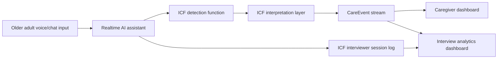
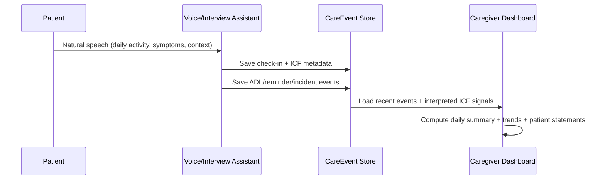

# Prettig Thuis

A Dutch, voice-first home support platform for older adults and caregivers, with real-time ICF signal detection and caregiver-facing insights.


## What This App Does

`Prettig Thuis` helps older adults with daily life and helps caregivers understand what is actually happening, based on real interactions.

Core outcomes:
- Real-time voice conversations with the older adult in Dutch.
- Detection and interpretation of ICF-related signals from natural patient speech.
- Structured care events for daily support workflows (ADL, reminders, incidents, check-ins).
- Caregiver dashboards that show patient-driven insights instead of placeholder stats.

## Product Flow



## Why It Is Different

Most care dashboards show generic activity counts. `Prettig Thuis` is built to tie dashboard insights back to what the patient actually says.

- Voice check-ins are stored with `user_id` and `session_id`.
- Patient utterances can be linked to detected and interpreted ICF codes.
- Caregiver views combine interview transcripts and real-time voice check-ins.

## Main App Areas

| Area | Purpose | Route/Page |
|---|---|---|
| Home | Main entry and navigation | `Home` |
| Voice assistant | Realtime Dutch voice support for routines | `VoiceHome`, `Talk2_0` |
| ICF interviewer | Structured patient interview + clinician handoff | `Gesprekspartner` |
| ICF analytics | Conversation analysis dashboard | `ICFInterviewDashboard` |
| Caregiver dashboard | Alerts, activity stream, daily summary, analytics | `Caregiver` |
| Daily routines | Task and ADL guidance | `Routines`, `Routines2_0` |
| Memory experiences | Album and memory content | `MemoryAlbum`, `GoudenMomenten`, `Videos` |
| Admin data tools | Upload ICF/knowledge/risk/training assets | `Admin*` pages |

## Realtime ICF Pipeline

The app distinguishes between:

- `detected_icf_codes`: raw codes inferred from speech.
- `interpreted_icf_codes`: context-adjusted output using local reasoning rules.

This separation is visible in the ICF dashboard and helps clinical review.

Example care event payload (simplified):

```json
{
  "user_id": "user_123",
  "session_id": "voice_home_1739360000",
  "type": "checkin",
  "source": "voice_home",
  "speaker": "user",
  "icf_tags": ["d450", "b152"],
  "confidence": 0.74,
  "data": {
    "user_text": "Lopen gaat moeilijk en ik ben bang om te vallen",
    "detected_icf_codes": ["d450", "b152"],
    "interpreted_icf_codes": ["d450", "b152", "b755"]
  }
}
```

## Caregiver Insight Flow



## How To Use (End-to-End)

1. Start a patient voice session in `VoiceHome` or `Talk2_0`.
2. Let the patient talk naturally about daily activities and difficulties.
3. Open `Gesprekspartner` for focused ICF interviewing when needed.
4. Review:
- `Caregiver`: alerts, recent activity, patient check-ins, ICF-linked stats.
- `ICFInterviewDashboard`: transcript evidence, detected vs interpreted codes, linked events.
5. Use Admin upload pages to update knowledge assets when clinical content evolves.

## Local Development

### 1) Install

```bash
npm ci
```

### 2) Run

```bash
npm run dev
```

### 3) Build

```bash
npm run build
```

If you hit legacy import compatibility issues, use:

```bash
BASE44_LEGACY_SDK_IMPORTS=true npm run build
```

### 4) Quality checks

```bash
npm run lint
npm run typecheck
```

## Project Structure

- `src/`: frontend pages, components, service integrations.
- `functions/`: server-side Base44 functions (ICF analysis, uploads, OpenAI session helpers).
- `src/lib/careEvents.js`: shared event persistence + normalization (backend-first, local fallback).
- `src/lib/icfInterpretation.js`: local interpretation layer for context-aware ICF scoring.
- `src/pages/ICFInterviewDashboard.jsx`: patient speech + ICF analytics UI.
- `src/components/caregiver/AlertSystem.jsx`: caregiver activity feed and daily summary.

## Key Knowledge/Policy Assets

Current knowledge-oriented files in repository root include:

- `conversation_policy.json`
- `icf_question_templates.json`
- `intervention_retrieval_logic.json`
- `structured_context_factors_schema.json`
- `icf_fac_master_knowledge_base.json`
- `icf_semantic_integration_config.json`
- `icf_kngf_richtlijn2025_integrated_knowledge_base.json`

These are used as structured semantic memory for question behavior, ICF interpretation, FAC estimation, and intervention mapping.

## Reliability & Safety Notes

- Care events are persisted through a shared service layer and normalized for dashboard consistency.
- Voice-origin events include `user_id` and `session_id` to reduce attribution errors.
- `functions/uploadICFTrainingDataset.ts` uses a non-destructive replacement strategy:
1. validate incoming dataset,
2. create replacement rows,
3. delete old rows only after successful creation,
4. rollback newly created rows on failure.

## Recent Improvements (2026)

- Realtime voice and interviewer flows now log patient check-ins in a dashboard-friendly format.
- Caregiver dashboard analytics tab now shows real metrics and recent patient statements.
- ICF dashboard now merges transcript-based and event-based patient input for stronger coverage.
- Daily summary cards now include speech and ADL activity, not only quest placeholders.

---

If you want, this README can be expanded further with real screenshots/GIFs from your current UI to create a true product landing page on GitHub.
