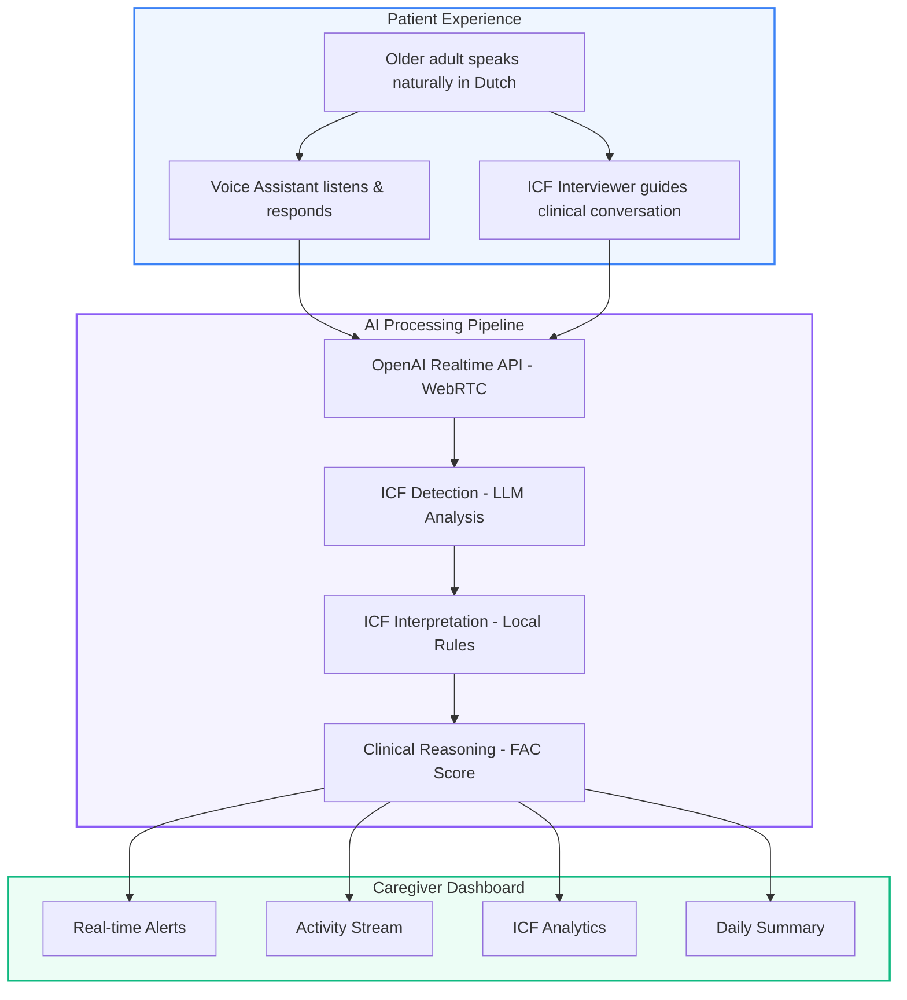
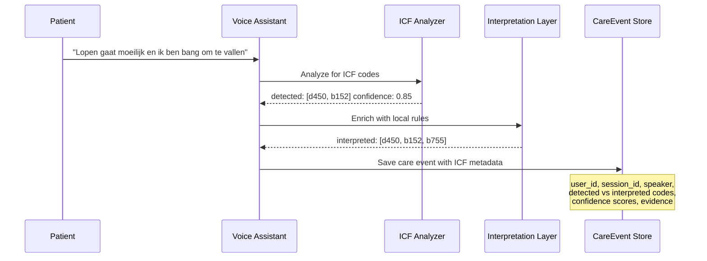
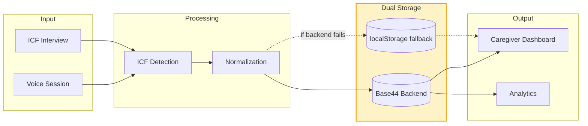

<div align="center">

# Prettig Thuis

### Voice-First Home Support for Older Adults & Caregivers

*Real-time Dutch voice conversations with ICF signal detection, clinical interviewing, and caregiver-facing insights — all in one platform.*

[](https://react.dev)
[](https://vitejs.dev)
[](https://base44.com)
[](https://tailwindcss.com)
[](https://platform.openai.com/docs/guides/realtime)
[]()

---

```
 "Lopen gaat moeilijk en ik ben bang om te vallen"
              |
              v
    [ ICF Detection: d450, b152 ]
              |
              v
    [ Caregiver Alert: Mobility + Fear of Falling ]
```

</div>

---

## The Problem

Most care dashboards show **generic activity counts** — steps taken, medications clicked, tasks completed. They tell caregivers *what happened* but not *why* or *how the patient feels*.

**Prettig Thuis** flips this by extracting clinical signals directly from **natural patient speech**, mapping them to the [ICF framework](https://www.who.int/standards/classifications/international-classification-of-functioning-disability-and-health), and surfacing actionable insights on a caregiver dashboard.

---

## How It Works



---

## Core Features

### Voice Assistant
> *Calm, patient, Dutch-speaking AI companion for daily routines*

| Feature | Detail |
|---|---|
| **Real-time speech** | OpenAI Realtime API via WebRTC, < 500ms latency |
| **Dutch language** | All interactions in natural Dutch |
| **Dementia-friendly** | Short sentences, binary choices, calm repetition |
| **Context-aware** | Suggests activities based on time of day and ICF profile |
| **Barge-in support** | Patient can interrupt at any time |

```
 Morning                    Midday                     Evening
+-------------------+  +-------------------+  +-------------------+
| Ochtendmedicatie  |  | Korte wandeling   |  | Dagafsluiting     |
| Ontbijt           |  | Familie bellen    |  | Voorbereiden      |
| Ochtendrekjes     |  | Licht tuinieren   |  |   voor slapen     |
+-------------------+  +-------------------+  +-------------------+
        Activity suggestions adapt to time of day
```

---

### ICF Signal Detection
> *Every patient utterance is analyzed for clinical signals*



**Two-layer detection:**

| Layer | Source | Purpose |
|---|---|---|
| `detected_icf_codes` | LLM analysis | Raw codes inferred from speech |
| `interpreted_icf_codes` | Local rules engine | Context-adjusted codes using keyword matching + profile boosting |

**Keyword → ICF mapping examples:**

| Dutch Keywords | Domain | ICF Codes |
|---|---|---|
| lopen, wandelen, trap, opstaan | Mobiliteit | d410, d415, d420, d450, d460 |
| vallen, evenwicht, duizelig | Balans | b235, b755, d410 |
| vergeet, geheugen, concentratie | Cognitief | b144, b164, d160 |
| moe, zwak, kracht | Spierkracht/Energie | b1300, b730 |
| eten, eetlust, slikken | Voeding | b510, d550 |

---

### Clinical ICF Interviewer
> *Structured patient interview with domain coverage tracking*

```
+----------------------------------------------------------+
|  Gesprekspartner - ICF Interview                         |
|                                                          |
|  Mode: PATIENT                                           |
|  Domains covered: 3/6  [=====>        ]                  |
|                                                          |
|  Mobiliteit .... covered (2 follow-ups)                  |
|  Balans ........ covered (2 follow-ups)                  |
|  Cognitief ..... covered (3 follow-ups)                  |
|  Pijn .......... not started                             |
|  Zelfzorg ...... not started                             |
|  Sociaal ....... not started                             |
|                                                          |
|  [When 3+ domains with 2+ follow-ups each]              |
|  --> Auto-switches to PROFESSIONAL summary mode          |
+----------------------------------------------------------+
```

**Clinical reasoning outputs:**
- **FAC Score** (Functional Ambulation Classification, 0-5)
- **Context factors** (pain, balance, fear of falling, environment severity)
- **Intervention suggestions** from KNGF guidelines

---

### Caregiver Dashboard
> *Real insights from real patient interactions*

```
+------------------------------------------------------------------+
|  Caregiver Dashboard                                              |
|                                                                   |
|  +------------------+  +------------------+  +------------------+ |
|  |   Alerts (3)     |  |  Daily Summary   |  |  ICF Analytics   | |
|  |                  |  |                  |  |                  | |
|  |  ! Fall risk     |  |  Check-ins: 4    |  |  d450: 0.85      | |
|  |  ! Low energy    |  |  ADL tasks: 6    |  |  b152: 0.72      | |
|  |  i Med reminder  |  |  Voice mins: 12  |  |  b1300: 0.68     | |
|  +------------------+  +------------------+  +------------------+ |
|                                                                   |
|  Recent Patient Statements                                        |
|  +---------------------------------------------------------+     |
|  | "Lopen gaat moeilijk" ............... d450, b755  0.85  |     |
|  | "Ik ben zo moe vandaag" ............ b1300       0.72  |     |
|  | "De medicijnen vergeet ik soms" .... b144, p360  0.68  |     |
|  +---------------------------------------------------------+     |
+------------------------------------------------------------------+
```

---

## Architecture

```
prettigthuis/
|
+-- src/
|   +-- pages/                    # App routes
|   |   +-- VoiceHome.jsx         # Voice assistant v1
|   |   +-- Talk2_0.jsx           # Voice assistant v2 (enhanced)
|   |   +-- Gesprekspartner.jsx   # ICF clinical interviewer
|   |   +-- Caregiver.jsx         # Caregiver dashboard
|   |   +-- ICFInterviewDashboard # Analytics dashboard
|   |   +-- Routines.jsx          # Daily routine guidance
|   |
|   +-- components/
|   |   +-- voice/                # Realtime voice components
|   |   +-- services/             # Voice + turn management
|   |   +-- caregiver/            # Alert system
|   |   +-- ui/                   # Radix UI component library
|   |
|   +-- lib/
|   |   +-- careEvents.js         # Backend-first event persistence
|   |   +-- icfInterpretation.js  # Local ICF enrichment rules
|   |   +-- icfClinicalReasoning  # FAC scoring + interventions
|   |   +-- AuthContext.jsx       # User auth + app settings
|   |   +-- app-params.js         # Base44 config resolution
|   |
|   +-- api/
|       +-- base44Client.js       # Base44 SDK initialization
|       +-- entities.js           # Data model exports
|       +-- integrations.js       # LLM, Email, SMS, File
|
+-- functions/                    # Base44 Deno serverless
|   +-- createOpenAISession.ts    # Ephemeral token generation
|   +-- analyzeConversationForICF # LLM-based ICF detection
|   +-- generatePromptAudio.ts    # TTS audio generation
|   +-- generateQuestAudio.ts     # Quest audio + upload
|   +-- upload*.ts                # Knowledge base ingestion
|
+-- [Knowledge Assets]           # Clinical policy & reference
    +-- conversation_policy.json
    +-- icf_question_templates.json
    +-- intervention_retrieval_logic.json
    +-- structured_context_factors_schema.json
```

---

## Data Flow

### Care Event Lifecycle



### Example Care Event

```json
{
  "user_id": "user_123",
  "session_id": "talk_2_0_1739360000",
  "type": "checkin",
  "source": "talk_2_0",
  "speaker": "user",
  "icf_tags": ["d450", "b152"],
  "confidence": 0.74,
  "data": {
    "user_text": "Lopen gaat moeilijk en ik ben bang om te vallen",
    "detected_icf_codes": ["d450", "b152"],
    "interpreted_icf_codes": ["d450", "b152", "b755"],
    "interpreted_icf_scores": { "d450": 0.85, "b152": 0.72, "b755": 0.65 },
    "interpretation_indicators": ["mobiliteit", "balans"],
    "interpretation_evidence": ["lopen", "vallen"]
  }
}
```

---

## Tech Stack

| Layer | Technology | Purpose |
|---|---|---|
| **Frontend** | React 18, Vite 6, TailwindCSS 3 | SPA with accessible, dementia-friendly UI |
| **UI Components** | Radix UI, Lucide icons | Accessible primitives |
| **Voice** | OpenAI Realtime API (WebRTC) | Low-latency bidirectional audio |
| **Speech Model** | `gpt-realtime` (GA) | Real-time conversation |
| **Transcription** | Whisper-1 | Speech-to-text |
| **ICF Detection** | Base44 LLM Integration | Clinical signal extraction |
| **Backend** | Base44 SDK + Deno Functions | Serverless API, auth, data storage |
| **Persistence** | Base44 Entities + localStorage | Dual-layer with automatic fallback |

---

## Local Development

```bash
# Install dependencies
npm ci

# Start dev server
npm run dev

# Build for production
npm run build

# If legacy import issues occur
BASE44_LEGACY_SDK_IMPORTS=true npm run build

# Quality checks
npm run lint
npm run typecheck
```

---

## Reliability & Safety

- **Non-destructive data operations** — upload functions validate before replacing, with rollback on failure
- **Dual-layer persistence** — Base44 backend with automatic localStorage fallback (max 500 items)
- **User attribution** — all voice events include `user_id` and `session_id`
- **Confidence thresholds** — only ICF codes with confidence >= 0.6 are surfaced
- **Clinical separation** — detected vs interpreted codes kept separate for clinician review

---

<div align="center">

*Built with care for those who care.*

**[Prettig Thuis](https://prettig-thuis-c7bc8a0f.base44.app)** | Powered by [Base44](https://base44.com) + [OpenAI Realtime API](https://platform.openai.com/docs/guides/realtime)

</div>
